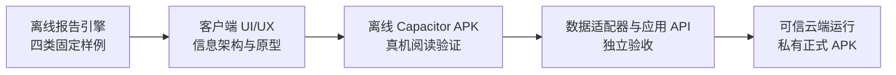

# 项目导航

## 产品目标

“知行”是仅供项目所有者本人使用的 Android 市场研究客户端。它通过可视化页面阅读、分类、检索和管理报告；未来由可信云端报告引擎完成“真实数据校验 → 报告生成 → 归档 → 受保护 API”，而不是自动交易或个性化荐股。

## 当前实施路线

> [!warning] 当前边界
> 仍处于 A→B 的地基与设计阶段：不初始化 Android 工程，不接入真实数据、模型、网络、密钥、云端日程、用户系统、正式归档、发布或通知。

## 核心入口

| 主题 | 正式资料 |
| --- | --- |
| 项目规则与安全边界 | [AGENTS.md](../../AGENTS.md) |
| 产品范围 | [product-requirements.md](../product-requirements.md) |
| 报告引擎架构 | [report-engine-architecture.md](../report-engine-architecture.md) |
| 当前进度 | [current-status.md](../current-status.md) |
| 个人 APK 变更 | [已确认提案](../proposals/2026-08-01-personal-android-apk-change-proposal.md) |
| 完整路线与待办 | [总路线图](../proposals/2026-08-01-project-work-system-audit-and-master-roadmap.md) · [地基清单](../proposals/2026-08-01-foundation-readiness-checklist.md) |
| 客户端设计基线 | [设计草案](../superpowers/specs/2026-08-01-personal-android-apk-client-design.md) |

## 常用索引

- [[决策与风险]]
- [[开发日志]]
- [[报告模板与研究]]
- [[收件箱]]

